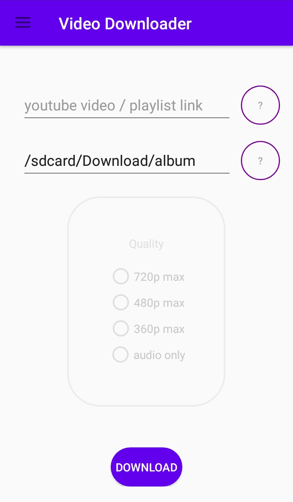
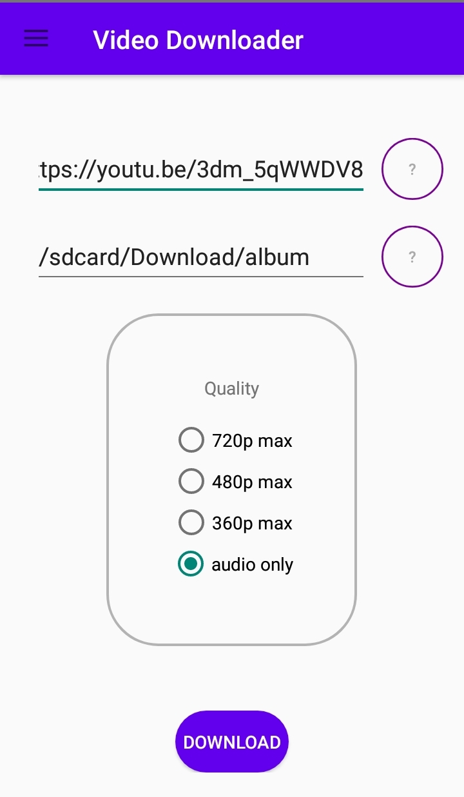

layout: page
title: "Android Video Downloader"
permalink: /index/
# Table of Content
- [Features](#features)
- [Download](#download)
- [Description](#description)
  - [License](#license)
  - [Privacy](#privacy)
- [About](#about)

## Features

Download videos from various sites like :
- Youtube
- Twitter
- TikTok
- Dailymotion

([See the full list of available websites](https://ytdl-org.github.io/youtube-dl/supportedsites.html))

    

## Download

[Download the lastest version from github](https://github.com/acmo0/Android-Youtube-Downloader/releases/latest).

Alternatively, you can build from source by downloading the source-code from github.

## Description

This application is a fully open-source project. The entire source code is available on [github](https://github.com/acmo0/Android-Youtube-Downloader).
### License
This software is released under the [GPL-v3.0](https://github.com/acmo0/Android-Youtube-Downloader/blob/master/LICENSE). This software uses :
1. [Chaquopy](https://chaquo.com/chaquopy/) MIT License
2. [yt-dlp](https://github.com/yt-dlp/yt-dlp) The Unlicense
3. [pytube](https://github.com/pytube/pytube) The Unlicense
4. [ffmpeg-android-java](https://github.com/WritingMinds/ffmpeg-android-java) GPLv3.0

### Privacy

Android Youtube Downloader does not collect any user data. Some data are stored ONLY locally on your smartphone in order to improve your user experience.

# About
See the [github repos](https://github.com/acmo0/Android-Youtube-Downloader) of the project.

See the [author github profile](https://github.com/acmo0).

See other projects of the author :
 - [GUI application for simple meteorological data analysis](https://github.com/acmo0/meteo)
 - [CTF write-ups](https://github.com/acmo0/write-ups)
 - [Description of an entire DIY pedalboard power supply](https://github.com/acmo0/PedalBoard-Power-Supply-Diy)
